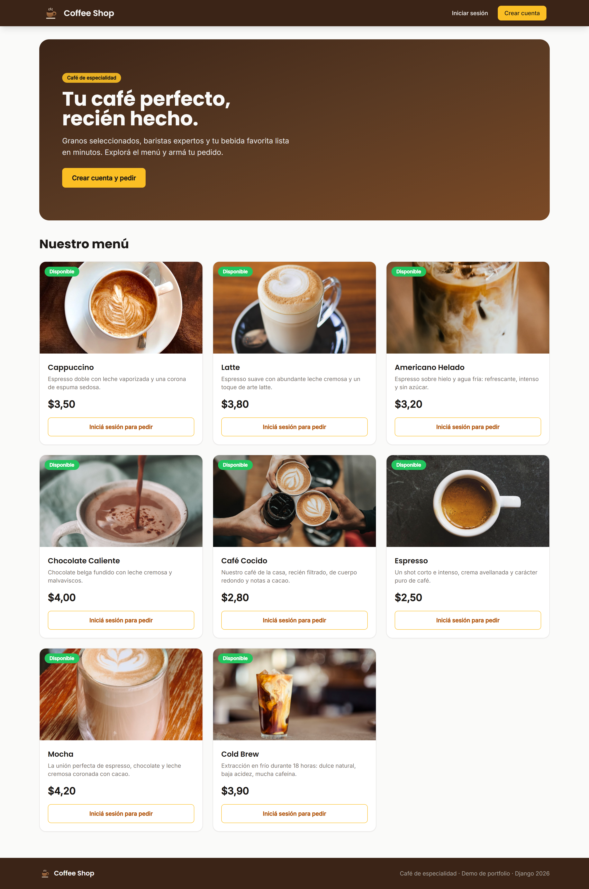

# ☕ Coffee Shop

A small but complete **coffee-shop ordering web app** built with **Django 6** and
**Tailwind CSS**. Browse the menu, build a cart, check out, and manage the
catalogue from the Django admin. Ships with a REST API and a one-command demo
seeder that populates realistic data and **real product photos**.



## Features

- **Public menu** with a hero, product grid and real coffee photography.
- **Accounts** — sign up (with welcome email), log in / out, per-user profile + avatar.
- **Cart & checkout** — add products, adjust quantities, confirm the order and
  receive a confirmation email.
- **Django admin** for products, orders and users (profile shown inline).
- **REST API** (`/productos/api/`) powered by Django REST Framework.
- **Email** on registration and checkout (console backend by default, SMTP-ready).

## Tech stack

| Layer     | Tech                                                   |
|-----------|--------------------------------------------------------|
| Backend   | Django 6, Python 3.14                                   |
| API       | Django REST Framework                                   |
| Frontend  | Django templates + Tailwind CSS (CDN), crispy-tailwind  |
| Database  | SQLite (local demo) · PostgreSQL / AWS RDS (production)  |
| Images    | Pillow · seed pulls from Unsplash & randomuser.me       |
| Testing   | Playwright (E2E walkthrough + screenshots)              |

## Quick start

```bash
python -m venv venv
venv\Scripts\python.exe -m pip install -r requirements.txt
venv\Scripts\python.exe manage.py migrate
venv\Scripts\python.exe manage.py seed_demo          # demo data + real images
venv\Scripts\python.exe manage.py runserver 127.0.0.1:8020
```

Open <http://127.0.0.1:8020>.

### Demo credentials

| Role     | User      | Password      |
|----------|-----------|---------------|
| Admin    | `admin`   | `admin1234`   |
| Customer | `cliente` | `cliente1234` |

## Configuration

All runtime config is read from environment variables (see [`.env.example`](.env.example)).
The app defaults to a **self-contained local SQLite database** so it runs with
zero external services. To point at the managed PostgreSQL/RDS instance instead,
set `USE_RDS=true` and provide the `DB_*` variables — the remote DB is never
touched unless you explicitly opt in.

## End-to-end walkthrough

A Playwright script captures full-page screenshots of every screen — see
[`e2e_portfolio/`](e2e_portfolio/README.md).

## Project layout

```
coffee_shop/   project settings & root URLs
products/      Product model, list/menu, create form, REST API, seed_demo command
orders/        Order & OrderProduct, cart, checkout, confirmation
users/         Auth (login/register), Profile model + avatar
templates/     base layout (navbar, logo, footer, flash messages)
static/img/    brand logo (SVG)
e2e_portfolio/ Playwright walkthrough + screenshots
```
